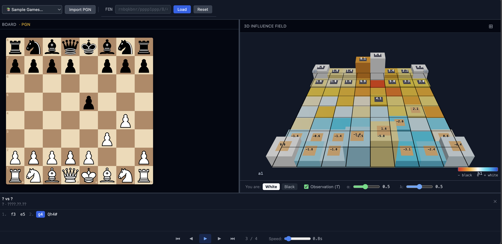
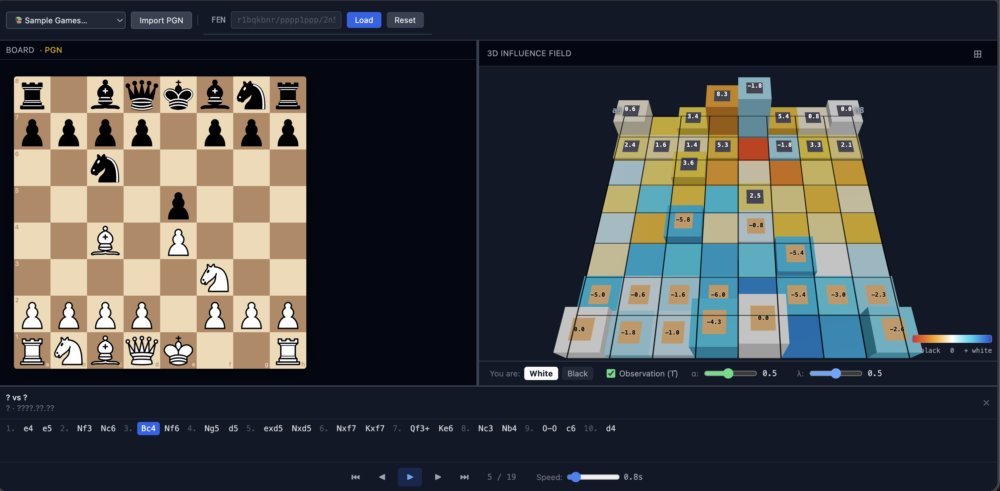
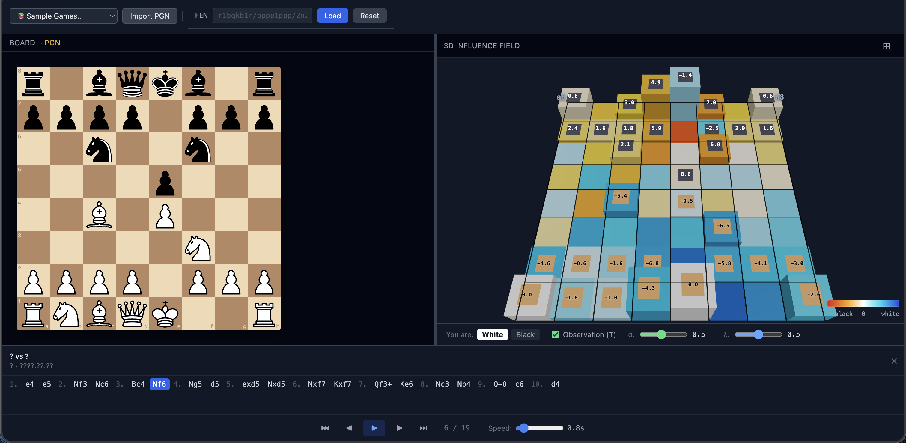
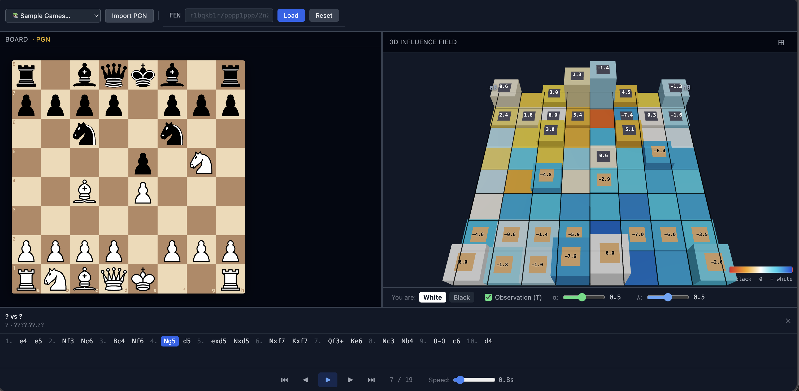

# Chess Quantum Field Visualizer

A 3D chess influence field visualization that models piece interactions using principles from Dirac's *The Principles of Quantum Mechanics* (1930) — sequence-based minimax with A*-inspired heuristic pruning to make tactical patterns visually emergent.

## The Idea

In quantum mechanics, a particle's behavior is governed by two operators:
- **Potential V̂** — the static field it sits in
- **Kinetic T̂** — its capacity to move and disrupt that field

We apply the same decomposition to chess:

| Mode | Physics | What it shows |
|---|---|---|
| **Potential** (Observation OFF) | V̂ — static pressure | Who attacks each square right now (attacker count) |
| **Observation** (Observation ON) | Ĥ = V̂ + αT̂ | Static pressure + "if I do X, they do Y, I do Z" (minimax sequences) |

The goal: anyone should be able to glance at the 3D field and see where the action is — like seeing a cat in a photo without scanning pixel by pixel.

## Demo


https://github.com/user-attachments/assets/c833055f-92b4-4f6c-adb7-db5629bb5ea4


> *Fried Liver Attack with Observation (T̂) enabled — watch how the field shifts as tactical threats develop.*

## Screenshots

| Fool's Mate (before Qh4#) | Fried Liver (Bc4 — Italian setup) |
|---|---|
|  |  |

| Fried Liver (3...Nf6) | Fried Liver (4.Ng5 — knight attack) |
|---|---|
|  |  |

The 3D field shows:
- **Blue blocks** = white pressure (deeper blue = stronger)
- **Orange/red blocks** = black pressure
- **Block height** = piece material value
- **Numeric labels** = exact field value per square
- **Gold/dark caps** = piece ownership (top 25% of each block)

## Piece Notation & Values

Standard algebraic notation throughout:

| Symbol | Piece | Value | Movement |
|---|---|---|---|
| **K** | King | 11 | 1 square, any direction |
| **Q** | Queen | 9 | Rank, file, or diagonal — unlimited |
| **R** | Rook | 5 | Rank or file — unlimited |
| **B** | Bishop | 3 | Diagonal — unlimited |
| **N** | Knight | 3 | L-shape (2+1), jumps over pieces |
| **P** | Pawn | 1 | Forward 1 (2 from start), captures diagonal |

Squares: file letter (a–h) + rank number (1–8). Example: **e4**, **Nf3**, **Qxd7**, **O-O**.

## The Model

### Potential V̂ — Static Attack Field (Observation OFF)

Simple attacker count per square:

```
V̂[square] = blackAttackers(square) - whiteAttackers(square)
```

- Positive (red) = black controls
- Negative (blue) = white controls
- **King exception**: on king squares, only enemy attackers count (king can't be traded, defenders don't cancel)

### Kinetic T̂ — Sequence-Based Minimax (Observation ON)

Models how players actually think: "if I move X, they respond Y, I follow up Z."

For each player:
1. **Pick candidate moves** (top 10 by threat: checks, captures, king proximity)
2. **Alpha-beta search** to find the best line (minimax with move ordering)
3. **Evaluate** the net outcome of the sequence (material + king pressure)
4. **Project** the evaluation back along the path with decay λ

```
For each candidate move:
  line = alphaBeta(position, depth, α, β)
  netGain = evaluate(endPosition) - evaluate(startPosition)
  
  For each step in the line:
    field[step.destination] += netGain × λ^(step_index + 1)
```

#### Threat-Based Amplitude

A move's signal strength = **how much the opponent loses if they don't respond**:

```
amplitude = max(moverValue, totalThreatenedValue) × λ^depth
```

A knight fork threatening Q(9) + R(5) radiates at amplitude 14, not 3.

#### A* Heuristic Pruning

Not all moves get deep search. Expansion decision:

```
expand(move) = amplitude × relevance(destination) ≥ τ

relevance = 0.5 × proximity_to_king + 0.3 × friendly_piece_under_attack + 0.2 × target_value
```

- Queen aimed at exposed king → expands deep
- Pawn push to quiet flank → pruned at depth 1

### Combined Ĥ = V̂ + αT̂

```
Field[square] = V̂[square] + α × T̂[square]
```

α controls how much the sequence-based kinetic adds to the base attack field.

## Visualization

- **Block height** = piece material value (taller = more valuable piece)
- **Block color** = field value (blue = white pressure, red = black pressure)
- **Top center 25%** = piece ownership (gold = white, dark = black)
- **Color mapping** = symmetric log normalization (prevents Q from drowning out P)

## Controls

| Control | What it does |
|---|---|
| **You are: White / Black** | Flips board orientation + camera |
| **☑ Observation (T̂)** | Toggles kinetic layer ON/OFF |
| **α** slider (0.1–1.0) | Weight of kinetic layer vs potential |
| **λ** slider (0.1–0.9) | Decay per depth in sequence projection |

## Key Visual Patterns

| Pattern | What it means |
|---|---|
| Deep blue zone | White dominates — multiple white sequences converge |
| Deep red zone | Black dominates — constructive black interference |
| Neutral/white square | Contested — waves cancel (destructive interference) |
| Piece block turning enemy color | Under attack, threatening sequences target it |
| King square deep enemy color | King is in danger — checkmate/mating attack visible |

## Architecture

```
src/
├── chess/
│   ├── attackField.ts            # V̂: attacker count per square (king exception)
│   ├── attackRadiation.ts        # T̂: sequence-based minimax with A* pruning
│   ├── attackRadiation.test.ts   # Behavioral tests (Fried Liver, Scholar's, Fool's Mate)
│   ├── interactionWeights.ts     # Piece-type interaction matrix (legacy, unused)
│   ├── turnExpansion.ts          # Legacy turn expansion (superseded by T̂)
│   ├── combinedField.ts          # Field combination utilities
│   ├── pieceField.ts             # Piece value field + constants
│   ├── gradient.ts               # Gradient computation
│   ├── interpolation.ts          # Field interpolation for smooth mode
│   ├── position.ts               # Position type (= Chess from chess.js)
│   └── sampleGames.ts            # 11 built-in PGN games
├── hooks/
│   └── useChessFields.ts         # Field computation orchestrator
├── visualization/
│   ├── ChessField3D.tsx          # Three.js 3D scene
│   ├── DiscreteBlocks.tsx        # BoxGeometry cuboids per square
│   └── FieldControls.tsx         # UI controls
├── scripts/
│   └── test-field.ts             # CLI test engine (npx tsx scripts/test-field.ts)
└── App.tsx                       # Layout + 2D board + PGN
```

## Documentation

- [`docs/wave-field-model.md`](docs/wave-field-model.md) — Original wave superposition model (V̂ theory)
- [`docs/dirac-quantum-field-model.md`](docs/dirac-quantum-field-model.md) — Dirac QM formulation (V̂ + T̂ + adaptive depth + A* pruning)

## Stack

Vite • React • TypeScript • Tailwind • chess.js • react-chessboard • Three.js • @react-three/fiber • @react-three/drei

## Running

```bash
npm install
npm run dev
```

## Testing

```bash
npx vitest run              # Unit tests (11 behavioral assertions)
npx tsx scripts/test-field.ts  # Manual field inspection (Fried Liver + Scholar's Mate)
```

## The Approximation

This model applies Dirac's quantum mechanics to a discrete, deterministic system:

1. **Discrete time** — moves are integers, not continuous
2. **Finite depth** — alpha-beta search truncated at configurable depth (A* heuristic prunes uninteresting branches)
3. **Deterministic collapse** — in QM, collapse is probabilistic; in chess, the player *chooses*
4. **Sequence evaluation** — the "measurement" returns the net material + positional gain of the best line

Despite these approximations, the model preserves the essential physics: superposition before measurement, collapse upon action, and the distinction between spatial potential (V̂) and temporal kinetics (T̂).
